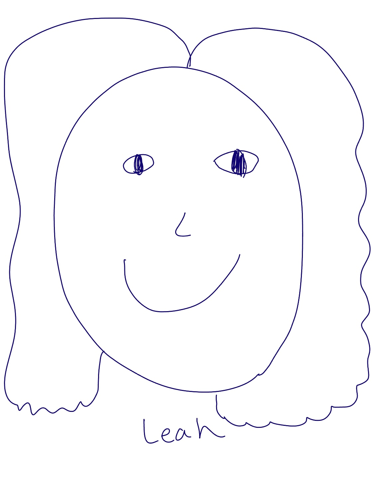
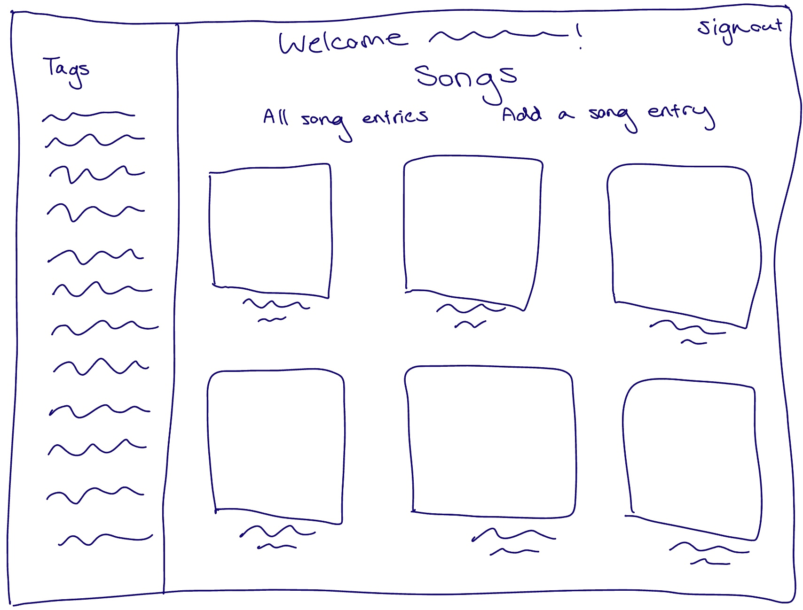
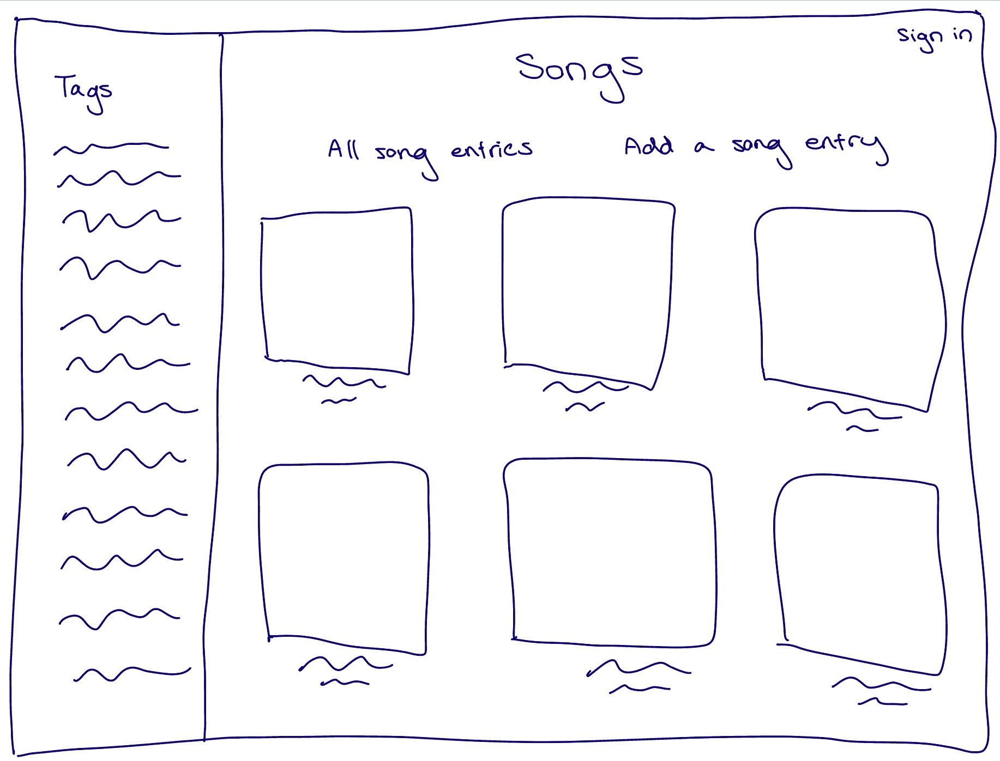
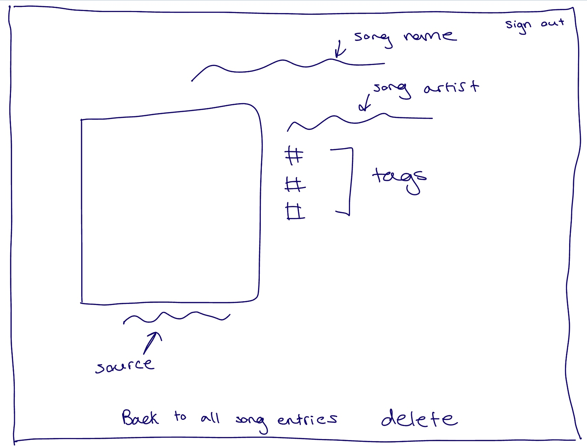
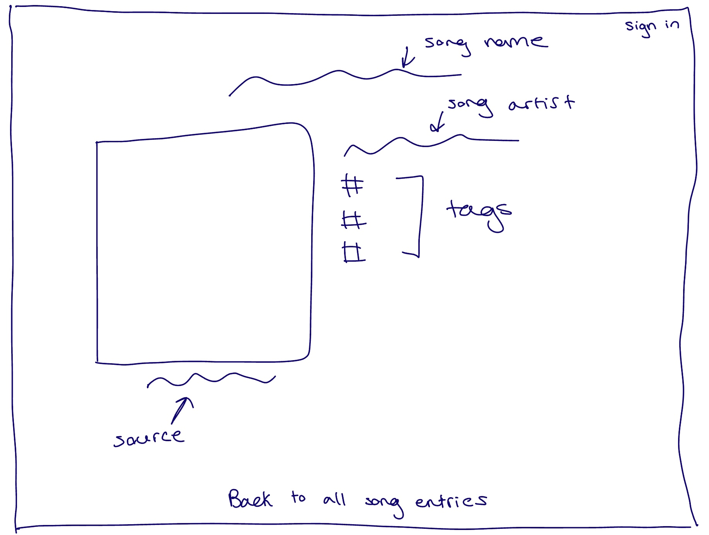
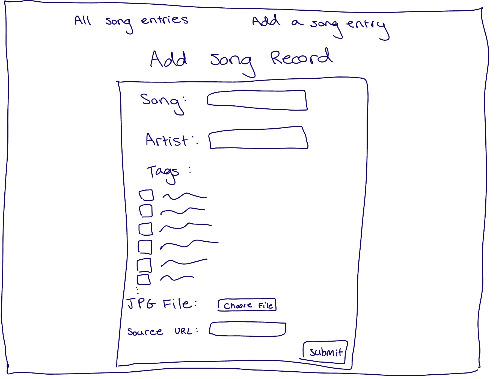
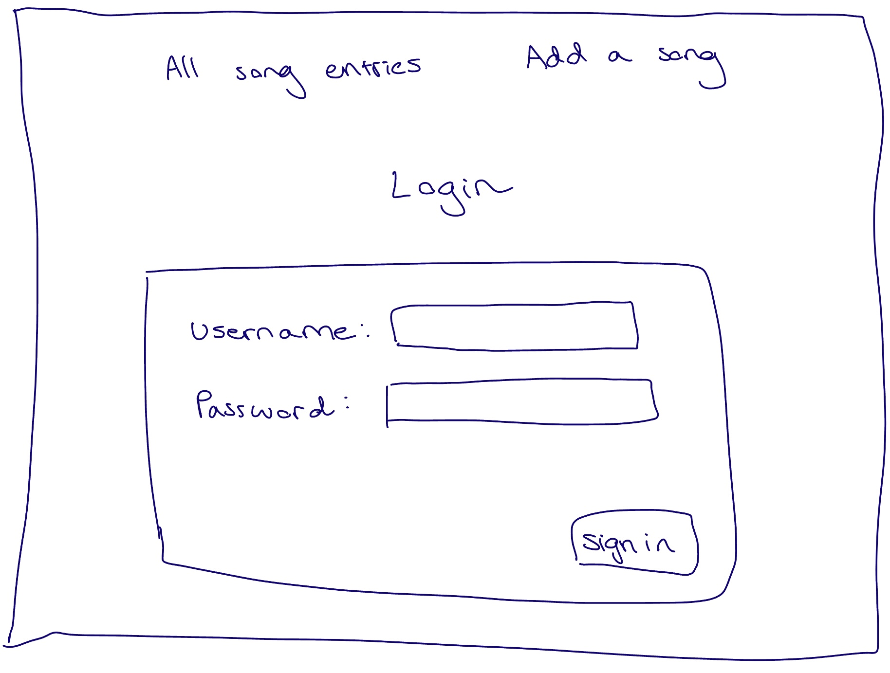
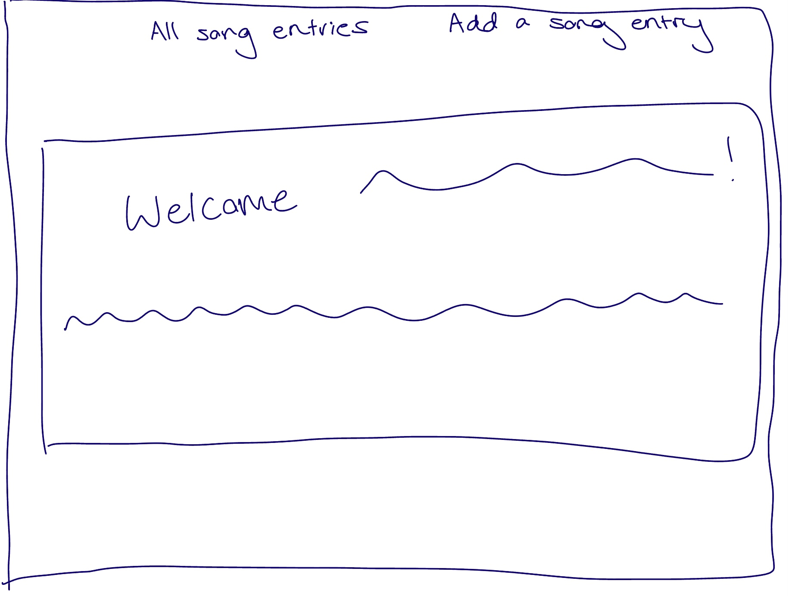

# Project 3: Design Journey

**For each milestone, complete only the sections that are labeled with that milestone.** Refine all sections before the final submission.

You are graded on your design process. If you later need to update your plan, **do not delete the original plan, rather leave it in place and append your new plan _below_ the original.** Then explain why you are changing your plan. Any time you update your plan, you're documenting your design process!

**Replace ALL _TODOs_ with your work.** (There should be no TODOs in the final submission.)

Be clear and concise in your writing. Bullets points are encouraged.

**Everything, including images, must be visible in _Markdown: Open Preview_.** If it's not visible in the Markdown preview, then we can't grade it. We also can't give you partial credit either. **Please make sure your design journey should is easy to read for the grader;** in Markdown preview the question _and_ answer should have a blank line between them.


## Design Plan (Milestone 1)

**Make the case for your decisions using concepts from class, as well as other design principles, theories, examples, and cases from outside of class (includes the design prerequisite for this course).**

You can use bullet points and lists, or full paragraphs, or a combo, whichever is appropriate. The writing should be solid draft quality.


### Catalog (Milestone 1)
> What will your catalog website be about? (1 sentence)

- My catalog website is about songs.


### _Consumer_ Audience (Milestone 1)
> Briefly explain your site's _consumer_ audience. Your audience should be specific, but not arbitrarily specific. (1 sentence)
> Justify why this audience is a **cohesive** group. (1-2 sentences)

- My audience are users who want to find new songs to listen to.
- This is a cohesive audience because users are able to find potential new songs to listen to. There will be a catalog with information on the song name, song artist, genre, and duration.


### _Consumer_ Audience Goals (Milestone 1)
> Document your _consumer_ audience's goals for using this catalog website.
> List each goal below. There is no specific number of goals required for this, but you need enough to do the job (Hint: It's more than 1. But probably not more than 3.)
> **Hint:** Users will be able to view all entries in the catalog and insert new entries into the catalog. The audience's goals should probably relate to these activities.

Goal 1: Find a new song to listen to

- **Design Ideas and Choices** _How will you meet those goals in your design?_
  - I will meet this goal by having a section in my catalog dedicated to the song name, artist, genre, and duration.

- **Rationale & Additional Notes** _Justify your decisions; additional notes._
  - It will be an efficient way for the user to view all the song information that is relevant.

Goal 2: Find a song based on specified genre

- **Design Ideas and Choices** _How will you meet those goals in your design?_
  - I will meet this goal by having a section specifically for genre. The user will be able to filter the catalog based on genre, so only the songs with that genre is shown.
- **Rationale & Additional Notes** _Justify your decisions; additional notes._
  - It will be an efficient way for the user to view the songs in their desired genre.

Goal 3: Explore songs based on their duration

- I will meet this goal by having a section in my catalog with the duration of a specific song. This will give the user information if the song is less than or more than 3 minutes.
- This will be an organized way for the user to see the criteria of the duration time of the song for their iking.


### _Consumer_ Audience Device (Milestone 1)
> How will your _consumer_ audience access this website? From a narrow (phone) or wide (laptop) device?
> Justify your decision. (1 sentence)

- Wide Screen
- This is because many users would want to see most album covers pertaining to their musical preferences at a time and a wide screen allows this to happen.

### _Consumer_ Persona (Milestone 1)
> Use the goals you identified above to develop a persona of your site's _consumer_ audience.
> Your persona must have a name and a face. The face can be a photo of a face or a drawing, etc.


- Persona name: Tim
- Tim wants to find new music to listen to

**Factors that Influence Behavior:**

- he does not want a song that is too short or too long
- he likes to explore various genres

**Goals:**

- Find new songs to listen to
- Explore different genres
- Find songs with different duration times

**Obstacles:**

- Hard time finding new songs pertaining to his interests
- Difficult to find new songs when making specific playlists

**Desires:**

- Wants to listen to new music
- Wants to explore new genres
- Wants to find new songs with genres he already knows he likes
- Wants to find songs that are short or long depending on the task he is doing


### _Administrator_ Audience (Milestone 1)
> Briefly explain your site's _administrator_ audience. Your audience should be specific, but not arbitrarily specific. (1 sentence)
> Justify why this audience is a **cohesive** group. (1-2 sentences)

- My audience are users who are avid music listeners that want to share song recommendations.

- This is a cohesive audience because these users will be able to input information about songs, such as the song name, artist, genre, and duration. They will be able to express information on a song they recommend and help other people who are looking for new music to listen to.


### _Administrator_ Audience Goals (Milestone 1)
> Document your _administrator_ audience's goals for using this catalog website.
> List each goal below. There is no specific number of goals required for this, but you need enough to do the job (Hint: It's more than 1. But probably not more than 3.)
> **Hint:** Users will be able to view all entries in the catalog and insert new entries into the catalog. The audience's goals should probably relate to these activities.

Goal 1: Share information about a song they enjoy listening to

- **Design Ideas and Choices** _How will you meet those goals in your design?_
  - I will meet this goal by having a section on a form for song name, title, genre, and duration.
- **Rationale & Additional Notes** _Justify your decisions; additional notes._
  - The user will be able to input information in an organized way into the database. Their input will be shown in the gallery of all the entries and have its own details page.

Goal 2: Express the genre of the song

- **Design Ideas and Choices** _How will you meet those goals in your design?_
  - I will meet this goal by having a section on the form to choose the genre of the song. This will be in the form of checkboxes, so the user is able to input as many genre tags they want for a song.
- **Rationale & Additional Notes** _Justify your decisions; additional notes._
  - This allows the user to give information on the genre of the song.

Goal 3: State the duration of the song

- I will meet this goal by having a section on the form about duration (if it is less than or more than 3 minutes).

- This allows the user to input the duration time of a specific song, which can be very helpful to someone for songs.

### _Administrator_ Persona (Milestone 1)
> Use the goals you identified above to develop a persona of your site's _administrator_ audience.
> Your persona must have a name and a face. The face can be a photo of a face or a drawing, etc.



Persona name: Leah

- Leah is an avid music listener who likes giving song recommendations and has multiple interests regarding the genre of a song.

**Factors that Influence Behavior:**

- Has friends who like sharing music recommendations
- Very enthusiastic about music they like

**Goals:**

- Share her knowledge of songs they like to others
- Help people find new song recommendations

**Obstacles:**

- Does not have a way to easily share their song recomenndations to other people

**Desires:**

- Wants to be able to help users find new songs based on the genre they are interested and the duration of the song.


### Catalog Data (Milestone 1)
> Using your personas, identify the data you need to include in the catalog for your site's audiences.
> Justify why this data aligns with your persona's goals. (1 sentence)

- song name
- song artist
- genre
- duration time

- This data aids the persona's with their goals because this information helps them find new songs to listen to based on their own criteria.


### Site Design (Milestone 1)
> Design your catalog website to address the goals of your personas.
> Sketch your site's design:
>
> - These are **design** sketches, not _planning_ sketches.
> - Use text in the sketches to help us understand your design.
> - Where the content of the text is unimportant, you may use squiggly lines for text.
> - **Do not label HTML elements or annotate CSS classes.** This is not a planning sketch.
>
> Provide a brief explanation _underneath_ each sketch. (1 sentence)
> **Refer to your persona by name in each explanation.**




> In this sketch, I designed the catalog in a gallery with filters on the left side in order for Tim and Leah to filter the songs how they want. There are 'All song entries' and 'Add a song entry' tabs on the top of the page in order for Tim and Leah to navigate through the site. Depending if the Leah is signed in or not there is a sign in/sign out tab on the upper right hand corner.




- In this sketch, I designed the details page where the Tim and Leah can click on an image in the gallery and and they are directed to an information page for that specific song, including the song name, artist, and the genre and duration tags it has. Depending on if Leah is signed in or not, a delete option is added to the bottom of the details page.



- In this sketch, I designed the form so that Leah can add a song name and artist. She is able to select the genre and duration tags in the form checkboxes for a specific song. She can also upload a jpg image of the song and optionally add the source url.



- In this sketch, I designed the login to be shown when Leah clicks the sign in tab on the upper right hand corner or when she clicks on the 'Add a song entry' tab. Leah has to login with her username and password.



- In this sketch, I designed the welcome screen in a way for the Leah's name to show up in a welcome message and instructions are shown to help the her navigate the site.


### Catalog Design Patterns (Milestone 1)
> Explain how you used design patterns in your site's design. (1-2 sentences)

- I used a gallery design pattern, which helps the user see an overview of the songs. There is also a form, which follows allignment design in order for it to guide the users eyes through my site.

## Implementation Plan (Milestone 1, Milestone 2, Milestone 3, Final Submission)

### Database Schema (Milestone 1)
> Plan the structure of your database. You may use words or a picture.
> A bulleted list is probably the simplest way to do this.
> Make sure you include constraints for each field.

Table: songs

- id: INTEGER (NN, PK, AI, U)
- name: TEXT (NN)
- artist: TEXT (NN)
- file_name: TEXT (NN)
- file_ext: TEXT (NN)
- source: TEXT


Table: tags

- id: INTEGER (NN, PK, AI, U)
- label: TEXT (NN)

Table: song_tags

- id: INTEGER (NN, PK, AI, U)
- song_id: INT (NN)
- tag_id: INT (NN)

Table: users

- id: INTEGER (NN, PK, AI, U)
- name: TEXT (NN)
- username: TEXT (NN, U)
- password: TEXT (NN)

Table: sessions

- id: INTEGER (NN, PK, AI, U)
- user_id: INT (NN)
- session: TEXT (NN, U)
- last_login: TEXT (NN)


### Database Query Plan (Milestone 1, Milestone 2, Milestone 3, Final Submission)
> Plan _all_ of your database queries.
> You may use natural language, pseudocode, or SQL.

- Plan a query

```
    $result = exec_sql_query(
      $db,
      "INSERT INTO songs (name, artist, file_name, file_ext, source) VALUES (:name, :artist, :file_name, :file_ext, :source);",
      array(
        ':name' => $form_values['name'], // tainted
        ':artist' => $form_values['artist'],
        ':file_name' => $upload_file_name,
        ':file_ext' => $upload_file_ext,
        ':source' => $upload_source // tainted
      )
    );
```

```
if (isset($tag_check)) {
  $result2 = exec_sql_query(
    $db,
    "SELECT songs.id AS 'songs.id', songs.name AS 'songs.name', songs.artist AS 'songs.artist', songs.file_name AS 'songs.file_name', songs.file_ext AS 'songs.file_ext', songs.source AS 'songs.source' FROM songs INNER JOIN song_tags ON (songs.id = song_tags.song_id) INNER JOIN tags on (song_tags.tag_id = tags.id) WHERE (:label = tags.label)",
    array(":label" => $tag_check)
  );
} else {
  $result2 = exec_sql_query(
    $db,
    "SELECT songs.id AS 'songs.id', songs.name AS 'songs.name', songs.artist AS 'songs.artist', songs.file_name AS 'songs.file_name', songs.file_ext AS 'songs.file_ext', songs.source AS 'songs.source' FROM songs"
  );
}
$records = $result2->fetchAll();
```

```
  $tags = exec_sql_query(
    $db,
    "SELECT * FROM tags"
  )->fetchAll();
```

```
  exec_sql_query(
    $db,
    "INSERT INTO song_tags (song_id, tag_id) VALUES (:song_id, :tag_id)",
    array(
      ':song_id' => $record_id,
      ':tag_id' => $tag['id']
    )
  );
```

```
    $result1 = exec_sql_query(
      $db,
      "SELECT songs.id AS 'songs.id', songs.name AS 'songs.name', songs.artist AS 'songs.artist', songs.file_name AS 'songs.file_name', songs.file_ext AS 'songs.file_ext', songs.source AS 'songs.source' FROM songs WHERE (id = $id_param);"
    );
```

```
    $result2 = exec_sql_query(
      $db,
      "SELECT tags.id AS 'tags.id', tags.label AS 'tags.label', song_tags.song_id AS 'song_tags.song_id', song_tags.tag_id AS 'song_tags.tag_id'
    FROM tags
    INNER JOIN song_tags ON tags.id = song_tags.tag_id
    WHERE song_tags.song_id = $id_param;"
    );
```

```
  exec_sql_query(
    $db,
    "DELETE FROM song_tags WHERE song_id = :song_id",
    array(':song_id' => $id_param)
  );
```

```
  exec_sql_query(
    $db,
    "DELETE FROM songs WHERE id = :id",
    array(':id' => $id_param)
  );
 ```


## Complete & Polished Website (Final Submission)

### Accessibility Audit (Final Submission)
> Tell us what issues you discovered during your accessibility audit.
> What do you do to improve the accessibility of your site?

- In my accessibility audit, I found errors as I did not have alternative text for my images. To improve the accessibility of my site I added an alt attribute to fix this issue.


### Self-Reflection (Final Submission)
> Reflect on what you learned during this assignment. How have you improved from Projects 1 and 2?

- I have learned a lot since the start of this project. This project helped me with my understanding of databases, especially with foreign keys as it defined relationships in my database. I also had practice retrieving my entries and tags from my database rather than hardcoding. I employed media catalog design patterns and implemented a site for both consumer and administrator users. This is shown as only login users can add, delete, and view, but non login users can only view the entries. Furthermore, this project helped me have a better understanding of SQL join clauses and securing queries with parameter markers. I improved from project 1 and project 2 by having a better understanding of databases overall and having more attention to detail. Compared to project 1 and project 2, I am able to debug my code much more efficiently.


> Take some time here to reflect on how much you've learned since you started this class. It's often easy to ignore our own progress. Take a moment and think about your accomplishments in this class. Hopefully you'll recognize that you've accomplished a lot and that you should be very proud of those accomplishments! (1-3 sentences)

- I have learned a lot since the start of this class and I am very proud of what I have accomplished. I have learned about server side processing with the help of PHP. I noticed the connections between databases and practiced querying through SQL. Overall, I gained a lot of knowledge and look forward to what I learn ahead in Information Science.


### Collaborators (Final Submission)
> List any persons you collaborated with on this project.

- N/A


### Reference Resources (Final Submission)
> Please cite any external resources you referenced in the creation of your project.
> (i.e. W3Schools, StackOverflow, Mozilla, etc.)

[Mozilla HTML](https://developer.mozilla.org/en-US/docs/Web/HTML)
[Mozilla CSS](https://developer.mozilla.org/en-US/docs/Web/CSS)


### Grading: User Accounts (Final Submission)
> The graders will need to log in to your website.
> Please provide the usernames and passwords.

**Administrator User:**

- Username: leah
- Password: monkey

**Consumer User:**

- Username: N/A
- Password: N/A
- My website does not support consumer log in

**Note:** Not all websites will support consumer log in. If your website doesn't, say so.


### Grading: Step-by-Step Instructions (Final Submission)
> Write step-by-step instructions for the graders.
> The project if very hard to grade if we don't understand how your site works.
> For example, you must log in before you can delete.
> For each set of instructions, assume the grader is starting from /

_View all entries:_

1. This is on the home page and it is on the page that first shows up to the user.
2. If on a page that is not the home page, the 'All song entries' tab will allows the user to get back to the view all entries page.

_View all entries for a tag:_

1. The user can use the side bar on the left side. There is a list of tags the user can click on. This will allow the user to see the entries for a specific tag

_View a single entry's details:_

1. The user can click on either the image correlating to the song or the song name/artist on the view entries page or the entries for a tag.

_How to insert and upload a new entry:_

- the user must be logged in to insert and upload a new entry

> If the user is not already logged in

1. The user can click on the 'Add a song entry' tab.
2. If the user is not already logged in, a login page will show up.
3. After the user is logged in, they will be taken to a form to insert and upload a song entry.
4. The user will fill in the text labels for song name and artist, select checkboxes for the tags of the song, upload a jpg image of the song, and optionally insert the source of the image.
5. The user clicks submit
6. The user is directed to the view all entries page and their new song entry is added to the gallery

> If the user is already logged in

1. The user can click on the 'Add a song entry' tab.
2. The user is taken to a form to insert and upload a song entry.
3. The user will fill in the text labels for song name and artist, select checkboxes for the tags of the song, upload a jpg image of the song, and optionally insert the source of the image.
4. The user clicks submit
5. The user is directed to the view all entries page and their new song entry is added to the gallery.


_How to delete an entry:_

- the user must be logged in to delete an entry

1. The user can click the 'Sign in' tab on the upper right hand corner to sign in.
2. A confirmation page will show up giving the user instructions how to navigate through the site.
3. On the view all entries page or a view all entries for a specific tag page, the user can click on the entry to navigate to the details page.
4. On the details page, there will be a 'delete' tab on the bottom of the page.
5. The user clicks on the 'delete' tab.
6. The user is navigated back to the view all entries page where they can see that the entry they deleted no longer appears.
